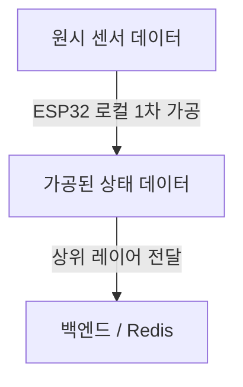
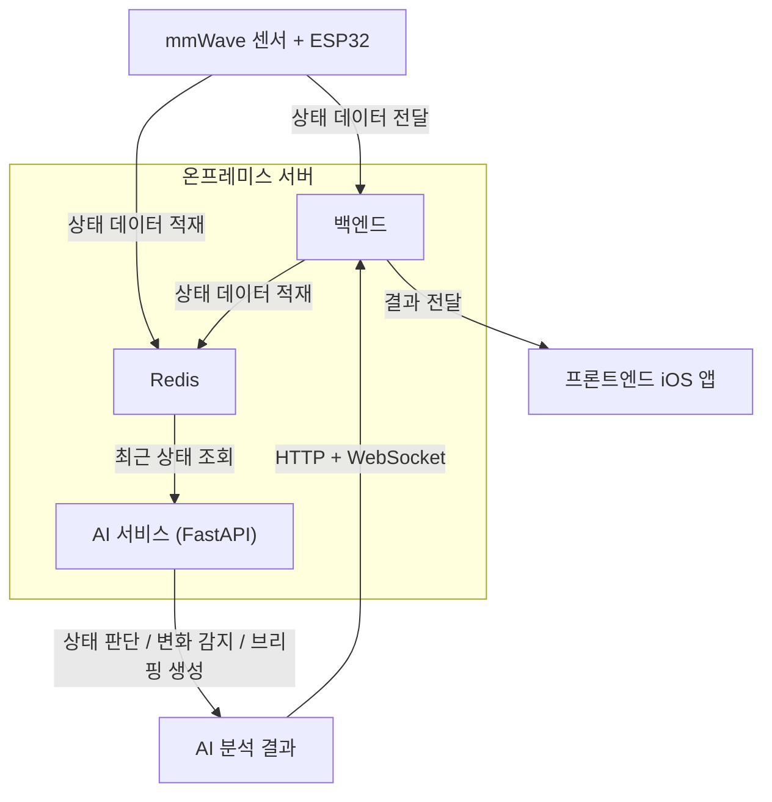

<h1>CareMate — 케어메이트</h1>

**카메라 없이 1인 가족의 상태를 확인하는 비접촉 안부 확인 서비스**

 

 
 
 
 
 

 

> 💬 *"연락 없이 간단하게, 평소처럼 잘 지내는지만 알고 싶어요."*

## 목차
1. [CareMate](#caremate)
2. [프로젝트 문제 정의](#프로젝트-문제-정의)
3. [MVP 구현 범위](#mvp-구현-범위)
4. [사용자 흐름 및 출력](#사용자-흐름-및-출력)
5. [시스템 구성과 각 레이어 책임](#시스템-구성과-각-레이어-책임)
6. [최소 데이터 계약](#최소-데이터-계약)
7. [팀 소개 및 Role](#팀-소개-및-role)
8. [KPI 목표](#kpi-목표)
9. [개발 일정](#개발-일정)

---

## CareMate
- CareMate는 mmWave 센서를 통해 떨어져 지내는 가족의 재실 / 호흡 / 심박을 감지하고 AI가 이를 분석, 브리핑하는 안부 확인 서비스입니다.
- 이 README는 해커톤 기간 동안 사용될 문서이며, 현재 구현 상태, MVP 범위, 레이어별 책임, 통합 경계를 정의합니다.

## 프로젝트 문제 정의
- 떨어져 사는 부모님/조부모님의 안부를 자주 확인하고 싶지만, 매일 전화하거나 영상으로 확인하는 방식은 양쪽 모두에게 부담이 된다.

### 기존 대안의 한계
- 📷 CCTV/웹캠은 사생활 침해에 대한 거부감이 크다.
- ⌚ 웨어러블은 착용과 관리가 번거로워 일상적으로 유지되기 어렵다.
- 📞 전화는 순간적인 확인 수단일 뿐 지속적인 상태 확인이 어렵다는 한계가 있다.

### 우리 프로젝트가 해결하는 문제
- 연락을 자주 하지 않아도 가족의 상태를 확인할 수 있는 수단을 제공하여 자녀 세대의 심리적 부담과 고령 가족 돌봄의 공백을 줄이는 것을 목표로 한다.
- 동시에 카메라 기반 감시의 프라이버시 문제와 웨어러블 관리 부담을 줄이는 비접촉 대안을 제안한다.

## MVP 구현 범위

### 1) ESP32 + mmWave 센싱
- mmWave 센서 기반 비접촉 상태 감지
- 재실 여부 / 호흡 / 심박 중심 데이터 수집
- 1인 가구 기준 단일 인원 감지 최적화
- ESP32 기반 센서 데이터 처리 및 전송
- 원시 센서 데이터 비저장 원칙
- 가공된 상태 데이터만 상위 레이어로 전달

### 2) 가족의 상태를 빠르게 이해할 수 있는 보호자 중심 UI
- 가족의 현재 상태를 한눈에 확인할 수 있는 카드형 UI
- 가족의 상태에 따라 표정과 분위기가 달라지는 3D 캐릭터
- 한 줄 메시지 + 캐릭터 + 상태 카드 + AI 브리핑 기반 정보 구조
- 복잡한 수치 대신 상태와 변화 중심 정보 전달로 5초 안에 빠르게 인지하는 직관적인 인터페이스
- MVP 기준 사용자 흐름: 로그인 → 메인 홈 → 장치 등록 → 가족 등록 → 상태 확인

### 3) AI 분석 및 개인화 브리핑
- 가공된 상태 데이터 기반 해석
- 최근 1시간 상태 이력 분석
- feature extraction 기반 변화량 계산
- Rule-based 이상 신호 탐지
- Anomaly-based 상태 추론
- 구조화된 요약 + 보호자용 브리핑 생성

## 사용자 흐름 및 출력
1. 사용자가 로그인합니다.
2. 장치를 연결하고 가족 정보를 등록합니다.
3. 센서 상태 데이터가 시스템에 적재됩니다.
4. AI가 최근 상태를 분석하고 브리핑을 생성합니다.
5. 사용자는 메인 홈에서 가족 상태를 확인합니다.
6. 필요 시 상세 정보, 디바이스 상태, 마이페이지를 확인합니다.

### 사용자에게 보여줄 출력
- 3D 캐릭터 및 상태 카드: 현재 상태를 빠르게 확인하는 메인 UI
- 한 줄 메시지: 15자 이내의 짧은 상태 표현
- 브리핑: 최근 변화, 해석 근거, 확인 권장 여부를 포함한 설명형 문장
- 상세 정보: 상태 변화와 디바이스 관련 추가 정보

### 브리핑 출력 예시
| 상태  | 한 줄 메시지 | 브리핑 예시 |
|------|-------------|-------------|
| 🟢 안정 | 오늘은 평온해요 | 현재까지는 평소와 비슷한 흐름이 유지되고 있어 비교적 안정적인 상태로 보입니다.  큰 이상 신호는 없으며, 일상적인 생활 패턴 안에서 움직임과 상태가 이어진 것으로 해석됩니다. |
| 🟡 주의 | 잠시 확인이 필요해요 | 최근 상태 흐름이 평소와 조금 다르게 나타나고 있습니다.  이상하다고 단정할 수준은 아니지만, 활동 패턴 변화가 보여 한 번 안부를 확인해 보시는 것이 좋겠습니다. |
| 🔴 경고 | 빠른 확인이 필요해요 | 평소와 다른 상태 변화가 비교적 크게 감지되고 있습니다.  원인을 단정할 수는 없지만, 평소와 다른 흐름이 이어지고 있어 직접 연락하거나 가능한 범위에서 빠르게 확인해 보시는 것을 권장합니다. |

## 시스템 구성과 각 레이어 책임

### 시스템 아키텍처
- 센서/백엔드는 상태 데이터를 Redis에 적재
- AI 서비스는 Redis를 직접 조회해 상태 판단, 변화 감지, 브리핑 생성을 수행
- 백엔드는 AI 결과를 받아 프론트에 전달
- 프론트 연동은 HTTP + WebSocket 기준으로 설계
- AI 서비스는 컨테이너로 패키징해 온프레미스 서버에서 백엔드와 포트를 분리해 운영

### Hardware
- mmWave 센서를 통해 재실 / 호흡 / 심박 중심 상태 데이터를 수집합니다.
- ESP32를 통해 센서 데이터를 처리하고 상위 레이어로 전달합니다.
- 원시 센서 데이터는 저장하지 않고, 가공된 상태 데이터만 전달하는 것을 원칙으로 합니다.

### Backend
- 센서 및 디바이스에서 전달된 상태 데이터를 수신합니다.
- 수신한 상태 데이터를 Redis에 적재합니다.
- AI 서비스의 분석 결과를 받아 프론트에 전달합니다.
- 프론트 연동은 HTTP + WebSocket 기준으로 구성합니다.

### Frontend
- 보호자가 가족의 현재 상태를 빠르게 확인할 수 있는 iOS 앱을 제공합니다.
- 상태 카드, 한 줄 메시지, 브리핑, 상세 정보, 디바이스/가족 관리 흐름을 담당합니다.
- 복잡한 원시 수치보다 상태와 변화 중심으로 정보를 전달합니다.

### AI
- Redis에 적재된 최근 상태 데이터를 직접 조회합니다.
- 최근 상태 이력을 기반으로 상태 판단, 변화 감지, 브리핑 생성을 수행합니다.
- 구조화된 분석 결과와 보호자용 자연어 브리핑을 생성합니다.

### 프론트/백엔드/AI/하드웨어 현재 상태

| 영역 | 현재 상태 | 비고 |
|------|-----------|------|
| Hardware | 진행 중 | ESP32 + mmWave 기준 센서 연동 |
| Backend | 진행 중 | Java / Spring Boot 기준, 세부 API는 추후 확정 |
| Frontend | 진행 중 | SwiftUI 기반 iOS 앱 중심 MVP 구현 |
| AI | 진행 중 | Python / FastAPI 기반 해석 및 브리핑 레이어 구현 |

### 기술 스택 상세

| 분류 | 기술 | 비고 |
|------|------|------|
| 하드웨어 | mmWave 센서 | 재실 / 호흡 / 심박 등 상태 감지 |
| 하드웨어 | ESP32 | 센서 연동 및 상태 데이터 전달 |
| 백엔드 | Java / Spring Boot | 상태 데이터 수신, Redis 적재, 프론트 전달 |
| 상태 버퍼 | Redis | 센서 / 백엔드 적재, AI 서비스 직접 조회 |
| AI | Python / FastAPI | 상태 판단, 변화 감지, 브리핑 생성 |
| 프론트엔드 | SwiftUI (iOS) | 보호자용 상태 확인 UX/UI, 브리핑 조회, 디바이스/가족 관리 기능 |
| 통신 | HTTP + WebSocket | 백엔드 → 프론트 결과 전달 |
| 인프라 | Docker + On-Premise Server | 백엔드 / AI 서비스 포트 분리 운영 |
| 협업 | GitHub / Notion / Figma | 형상관리, 문서화, 디자인 협업 |

## 최소 데이터 계약

### 상태 데이터 입력
- 협의 중
### AI 분석 결과 출력
- 협의 중

## 팀 소개 및 Role
**[5팀] N인데 N아닌팀**

| 이름 | 역할 | 담당 |
|------|------|------|
| 👩‍💼 김지윤 | PM | 프로젝트 방향성 수립, 범위 및 기능 우선순위 정의, 일정/마일스톤 관리, 요구사항 정리, 팀 간 의사결정 및 데모 구성 총괄/ 사용자 여정 설계 |
| 🔐 유희현 | AI / 정보보호 | AI 로직 설계, AI 응답 품질 검증, 안전성/취약점 점검, 개인정보/권한/보안 정책 점검, 기획/일정/이슈 관리 지원 |
| 🎨 김윤정 | 디자인 | AI 서비스 특성을 반영한 핵심 화면/예외 상황 UX 설계, 와이어프레임/프로토타입 제작, 디자인 시스템 정리 |
| 💻 서원지 | 프론트엔드 | 프론트엔드 UI 구현, 사용자 흐름 end-to-end 구현, 통합 테스트 및 서비스 완성도 개선, 백엔드 연동  |
| ⚙️ 소준영 | 백엔드 / 인프라 | 백엔드 리드, 하드웨어, 아키텍처 설계, 핵심 서버 구조 설계, 배포 환경 구축, CI/CD 구성, 운영 안정화, 기술 이슈 해결 및 코드 리뷰 |
| 🔧 권순일 | 백엔드 | 기본 API 구현, 회원 기능(Google OAuth, 초대 코드 기반 로그인), AI 연동 |
| 🗄️ 진민규 | 백엔드 | 기본 API 구현, 실시간 데이터 전송(WebSocket) |

## KPI 목표

| 지표 | 목표 | 기준 |
|------|------|------|
| 페인포인트 실재 확인율 | 80% | 인터뷰 5명 중 4명 이상 "전화 부담 or CCTV 거부감" 자발 언급 |
| 컨셉 공감도 | 70% | 설문 응답자 중 "쓸 의향 있음" 동의 비율 |
| 월 구독료 (WTP) | ₩5,900 | 인터뷰 대상자 50% 이상 지불 의향 |
| 유료 전환율 | 5%+ | 타겟 200~300만 명 중 초기 10~15만 사용자 목표 |

## 개발 일정

**2026 DEEPDIVE HACKATHON**

| 단계 | 내용 |
|------|------|
| 기획 | 서비스 설계, 페르소나 정의, KPI 설정 |
| 설계 | UI/UX 와이어프레임, API 설계, DB 스키마 |
| 개발 | 센서 연동, 백엔드 API, 프론트 앱, AI 브리핑 |
| 발표 | 멘토 발표 (1차) → 최종 발표 |