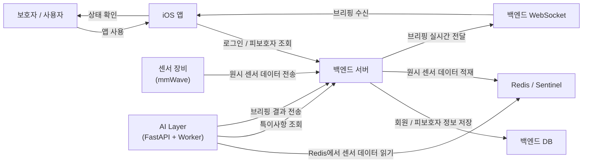
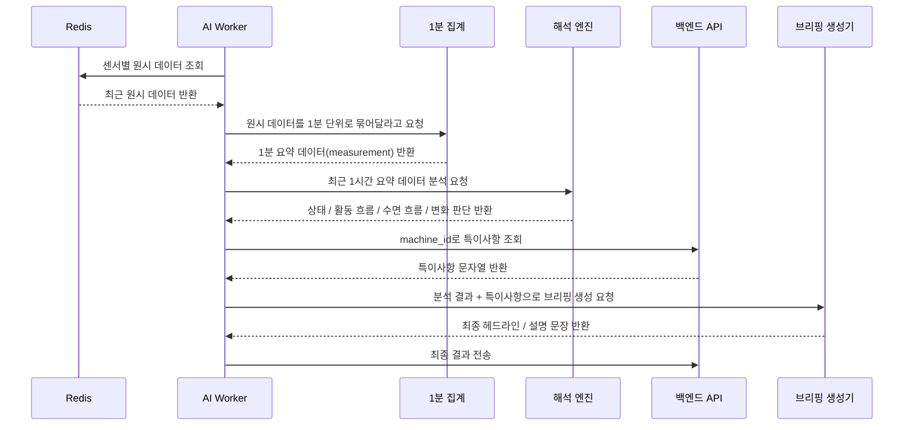

<h1>CareMate — 케어메이트</h1>

**카메라 없이 가족의 상태를 확인하는 비접촉 안부 확인 서비스**

 

 
 
 
 
 

 

> 💬 *"쉽고 가볍게, 평소처럼 잘 지내는지 알고 싶어요."*

## 목차
1. [CareMate 소개](#caremate-소개)
2. [해결하려는 문제](#해결하려는-문제)
3. [전체 시스템 구조](#전체-시스템-구조)
4. [AI 파이프라인](#ai-파이프라인)
5. [사용자 경험 흐름](#사용자-경험-흐름)
6. [기술 스택](#기술-스택)
7. [팀 소개](#팀-소개)

---

## CareMate 소개
CareMate는 mmWave 센서를 이용해 가족의 상태를 비접촉으로 감지하고, AI가 이를 해석하고 개인화하며 가족의 안부를 확인하는 서비스입니다.

이 프로젝트의 핵심은
“가족이 지금 평온한지 / 조금 변화가 있는지 / 바로 확인이 필요한지”를 짧고 이해하기 쉬운 형태로 전달하는 것입니다.

전달된 가족의 안부를 통해 연락의 계기를 만들고, 안부를 묻는 연락이 좀 더 쉬워지게 유도합니다.

---

## 해결하려는 문제
떨어져 사는 부모님이나 조부모님의 안부를 자주 확인하고 싶어도,
매일 전화하거나 영상으로 확인하는 방식은 양쪽 모두에게 부담이 될 수 있습니다.

### 기존 대안의 한계
- 📷 CCTV/웹캠은 사생활 침해 거부감이 큼
- ⌚ 웨어러블은 착용과 관리가 번거로움
- 📞 전화는 순간 확인은 가능하지만, 생활 흐름 전체를 보기 어려움

### CareMate가 제안하는 방식
- 카메라 없이
- 몸에 무언가를 꼭 착용하지 않아도
- 비접촉으로 가족의 안부를 확인하고
- AI가 그 흐름을 짧은 브리핑으로 정리해 전달

---

## 전체 시스템 구조

### 쉬운 설명
- **센서**가 상태 데이터를 만든다.
- **백엔드**가 그 데이터를 Redis에 쌓는다.
- **AI Layer**가 Redis에서 데이터를 읽어 최근 흐름을 분석한다.
- AI는 보호자의 특이사항도 가져온다.
- AI는 최종 브리핑 결과를 다시 백엔드로 보낸다.
- **백엔드**는 그 결과를 iOS 앱으로 전달한다.
- **보호자**는 앱에서 최종 상태를 본다.

---

## AI 파이프라인

### 개인화된 AI
1. 사용자의 데이터를 기반으로 baseline을 정교화한다.
   - 분석이 반복될 때마다 사용자의 '정상 상태'가 점차 고정되며 변화 신호가 정교하게 개선된다.
2. 가족의 특이사항을 입력하여 개인화된 브리핑을 제공한다
   - ex) 특이사항 : 천식이 있습니다. → "오늘 기침이 심하셨어요. 천식약을 잘 챙겨드시고 계신지 연락해보는 것이 어떨까요?"
### 쉬운 설명
1. **원시 데이터 읽기**
   - Redis에서 센서 raw 데이터를 읽습니다.
2. **1분 단위로 묶기**
   - 너무 잘게 들어온 데이터를 1분 기준으로 요약합니다.
3. **최근 1시간 분석**
   - 최근 흐름을 보고 안정 / 변화 / 위험 신호를 판단합니다.
4. **특이사항 반영**
   - 프론트에서 입력한 특이사항 메모를 같이 참고합니다.
5. **브리핑 문장 생성**
   - 읽기 쉬운 문장으로 상태를 설명합니다.
6. **최종 payload 전송**
   - 백엔드가 사용하는 형식으로 정리해 전달합니다.

---

## 사용자 경험 흐름
### 보호자 기준 기본 흐름
1. 앱에 로그인
2. 피보호자 정보 확인
3. 센서가 상태 데이터 수집
4. AI가 최근 흐름을 분석
5. 앱에서 상태 카드 / 브리핑 확인

---

## 기술 스택

| 분류 | 기술 | 역할 |
|------|------|------|
| 하드웨어 | mmWave | 상태 감지 |
| 백엔드 | Java / Spring Boot | 회원/피보호자/특이사항 관리, AI 결과 수신 |
| 상태 저장 | Redis / Sentinel | 센서 raw 데이터 저장 |
| AI | Python / FastAPI | 상태 해석, 브리핑 생성 |
| 프론트엔드 | SwiftUI (iOS) | 보호자용 상태 확인 앱 |
| 실시간 전달 | WebSocket | 브리핑 결과 전달 |
| 인프라 | Docker / On-Premise | 서비스 배포 및 운영 |

---

## 팀 소개
**[5팀] N인데 N아닌팀**

| 이름 | 역할 | 담당 |
|------|------|------|
| 👩‍💼 김지윤 | PM | 프로젝트 방향 정의, 범위/기능 우선순위, 일정 관리 |
| 🔐 유희현 | AI / 정보보호 | AI 로직, 프롬프트/브리핑 품질, 안전성/보안 점검 |
| 🎨 김윤정 | 디자인 | 핵심 화면 UX, 와이어프레임, 디자인 시스템 |
| 💻 서원지 | 프론트엔드 | iOS UI 구현, 사용자 흐름, 백엔드 연동 |
| ⚙️ 소준영 | 백엔드 / 인프라 | 임베디드, 서버 구조, 배포 환경, 운영 안정화 |
| 🔧 권순일 | 백엔드 | 회원 기능, 백엔드 API, AI 연동 |
| 🗄️ 진민규 | 백엔드 | 실시간 데이터 전송, WebSocket, 초대 코드 |

---

## 마무리
CareMate는 단순히 센서 숫자를 보여주는 서비스가 아니라,
**보호자가 이해하기 쉬운 안부 브리핑으로 바꾸는 시스템**을 목표로 합니다.

핵심은 기술 자체보다,
**가족이 큰 부담 없이 안심할 수 있도록 정보를 제공하는 경험**에 있습니다.
